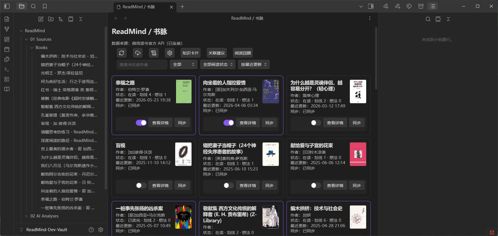
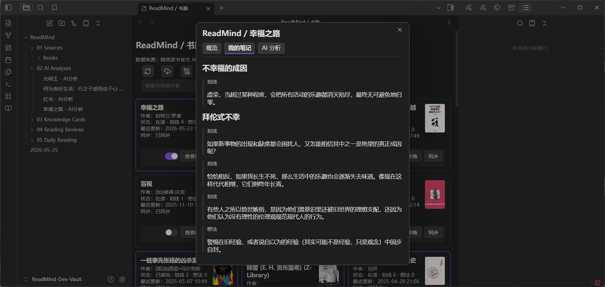
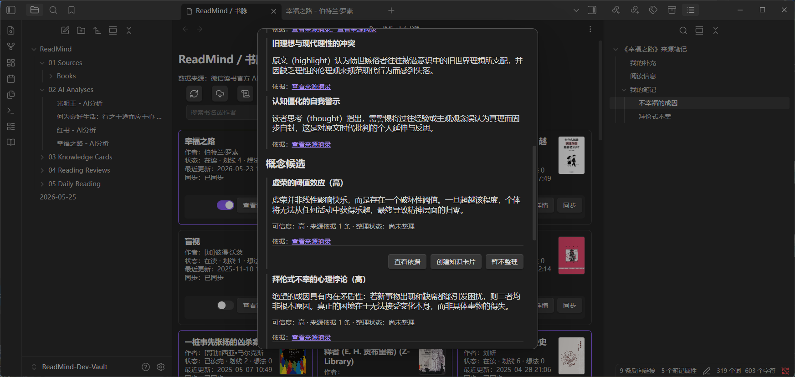
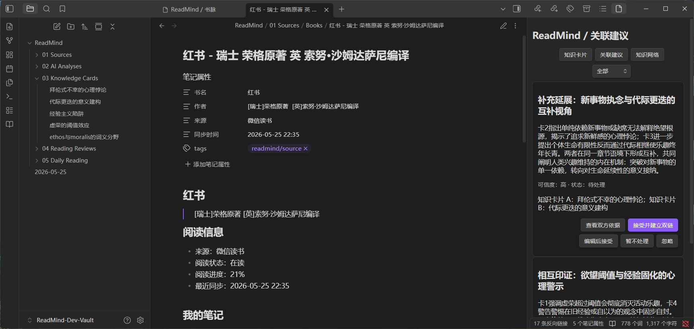
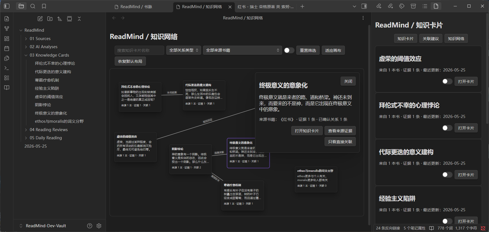
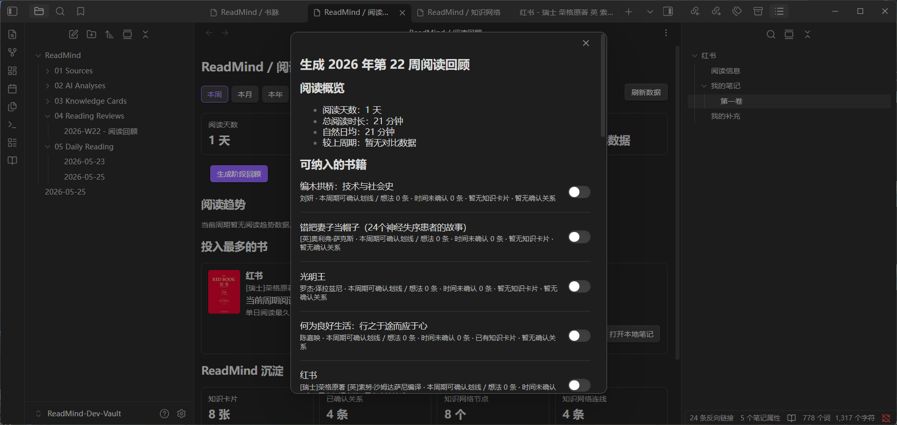

# ReadMind / 书脉

记时随想：
```
	阅读对一个人的塑造，缓慢地、间歇地、不易察觉地，发生在眼前这页书行中映出了另一本书中的字句，发生在雨滴落在铁皮棚上敲出了韵脚，神经信号以实实在在的电流击中沟回边一棵枯朽的树，随后倾倒、化进泥土。我们只需长按文字、划线、加入笔记，等它再生出枝叶。
```

ReadMind / 书脉是一款面向 Obsidian 的阅读知识沉淀插件。它通过微信读书官方 API 获取用户授权范围内的书架、阅读进度、划线、想法与阅读统计，并在 Obsidian 中进一步支持证据化 AI 分析、知识卡片整理、关系确认、知识网络画布与阶段阅读回顾。

> 当前版本为开发预览版，功能与界面仍在持续完善中。使用前建议备份 Vault，并妥善保管微信读书 API Key 与 AI 模型 API Key。

## 功能

- **微信读书同步**：同步书架、阅读状态、划线、想法与阅读统计。
- **来源笔记生成**：将个人阅读笔记按章节整理为可引用的 Obsidian Markdown。
- **证据化 AI 分析**：AI 分析只基于用户真实划线与想法，并保留来源引用。
- **知识卡片**：由用户确认后将概念整理为独立知识卡片。
- **关联建议与双链**：在用户确认后建立知识卡片之间的联系。
- **知识网络画布**：以可拖拽卡片与连线浏览个人知识网络。
- **阅读回顾**：查看阅读统计，并生成带来源证据的阶段阅读回顾。

## 功能展示

### 书架与阅读数据



### 来源笔记与 AI 分析





### 知识卡片与知识网络





### 阶段阅读回顾



## 安装

ReadMind 当前尚未发布至 Obsidian 社区插件市场，需要手动安装。

### 通过 GitHub Release 安装

1. 在本仓库的 Releases 页面下载当前版本的以下文件：

   ```text
   manifest.json
   main.js
   styles.css
   ```

2. 在你的 Obsidian Vault 中创建插件目录：

   ```text
   <你的 Vault>/.obsidian/plugins/readmind-ai-enhanced-readingnotes/
   ```

3. 将 `manifest.json`、`main.js`、`styles.css` 复制到该目录中。

4. 重新启动 Obsidian，或重新加载插件。

5. 在 `设置 → 第三方插件` 中启用 ReadMind。

### 从源码构建

```bash
npm install
npm run build
```

构建完成后，将以下文件复制到：

```text
<你的 Vault>/.obsidian/plugins/readmind-ai-enhanced-readingnotes/
```

所需文件：

```text
manifest.json
main.js
styles.css
```

## 配置与使用

1. 在 ReadMind 设置中选择 `微信读书官方 API` 作为数据来源，并填写微信读书 API Key。
2. 需要使用 AI 功能时，选择模型供应商并填写对应 API Key；不使用 AI 功能时可不配置。
3. 回到 ReadMind 主页面刷新书架，并同步需要整理的书籍。
4. 从书籍详情进入 AI 分析、知识卡片、关联建议、知识网络与阅读回顾流程。

## 开发状态

ReadMind 当前仍处于开发预览阶段，以下内容后续仍可能继续调整：

- 界面与交互细节；
- 凭据存储与发布安全方案；
- 不同 Obsidian 环境与模型供应商的兼容性；
- 阅读回顾与知识网络的体验优化。

当前版本适合个人学习、阅读知识整理与项目展示使用。用于重要资料库前，请先备份 Vault。

## 免责声明

ReadMind 仅用于个人学习与阅读知识沉淀。插件通过微信读书官方 API 获取用户授权范围内可访问的数据，用于在本地整理个人书架、阅读记录、划线与想法；不提供书籍全文抓取、破解、转载或公开分发功能。

使用者应遵守微信读书相关服务规则及适用的著作权法律法规，并自行妥善保管微信读书 API Key 与 AI 模型 API Key。

## 致谢

- [Obsidian Weread Plugin](https://github.com/zhaohongxuan/obsidian-weread-plugin)
- [微信读书 Skills](https://github.com/Tencent/WeChatReading)
